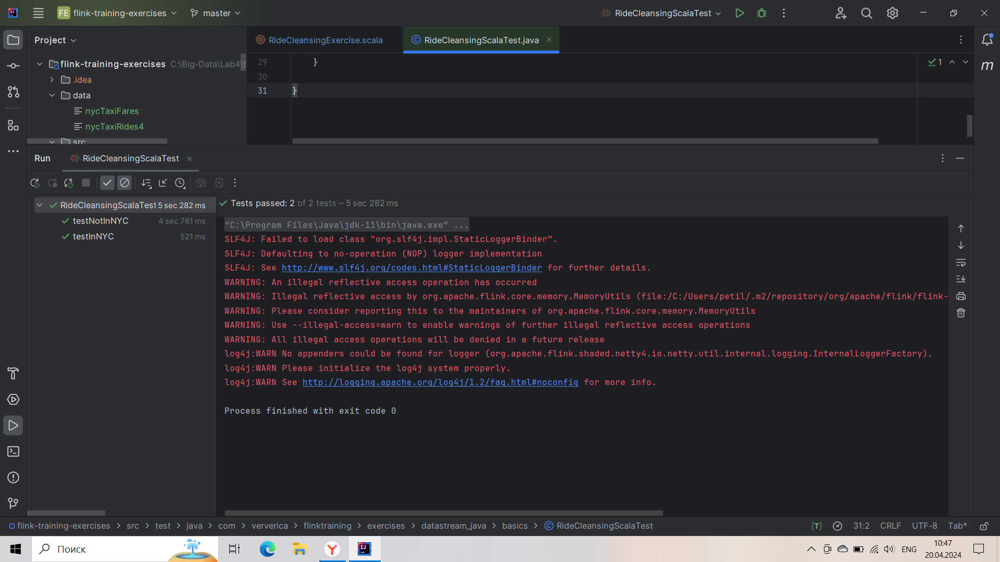

# Лабораторная 4. Потоковая обработка в Apache Flink
В ходе выполнения лабораторной работы были сделаны 4 упражнения.

## 1. RideCleanisingExercise
Код:
```scala
object RideCleansingExercise extends ExerciseBase {
  def main(args: Array[String]) {
    // parse parameters
    val params = ParameterTool.fromArgs(args)
    val input = params.get("input", ExerciseBase.pathToRideData)

    val maxDelay = 60 // events are out of order by max 60 seconds
    val speed = 600   // events of 10 minutes are served in 1 second

    // set up the execution environment
    val env = StreamExecutionEnvironment.getExecutionEnvironment
    env.setParallelism(parallelism)

    // get the taxi ride data stream
    val rides = env.addSource(rideSourceOrTest(new TaxiRideSource(input, maxDelay, speed)))

    val filteredRides = rides
      // filter out rides that do not start and end in NYC
      .filter(ride => GeoUtils.isInNYC(ride.startLon, ride.startLat) && GeoUtils.isInNYC(ride.endLon, ride.endLat))

    // print the filtered stream
    printOrTest(filteredRides)

    // run the cleansing pipeline
    env.execute("Taxi Ride Cleansing")
  }
}
```
Тест:

