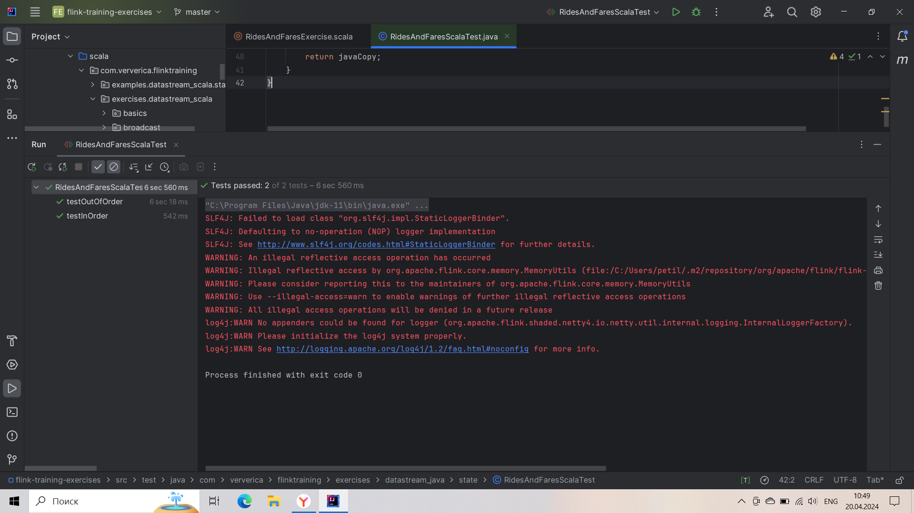
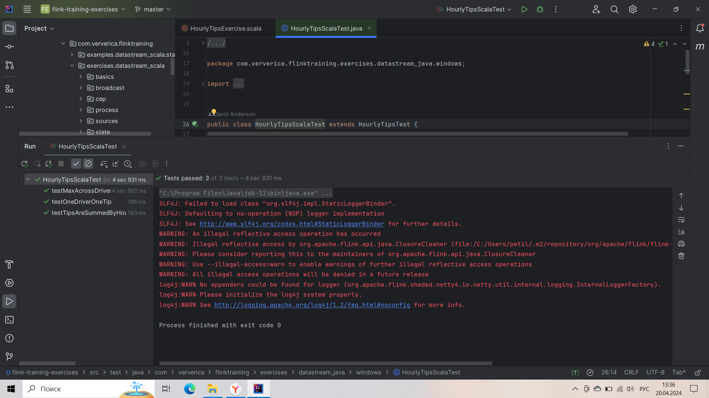
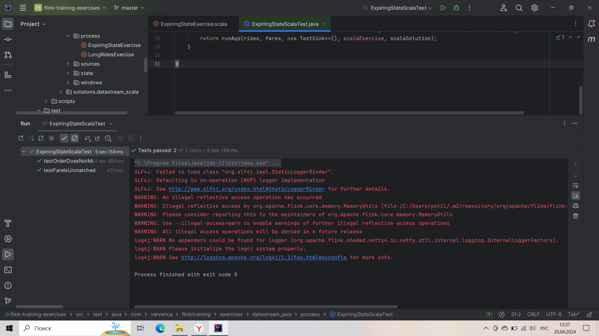

# Лабораторная 4. Потоковая обработка в Apache Flink
В ходе выполнения лабораторной работы были сделаны 4 упражнения.

## 1. RideCleanisingExercise
Код:
```scala
object RideCleansingExercise extends ExerciseBase {
  def main(args: Array[String]) {
    // parse parameters
    val params = ParameterTool.fromArgs(args)
    val input = params.get("input", ExerciseBase.pathToRideData)

    val maxDelay = 60 // events are out of order by max 60 seconds
    val speed = 600   // events of 10 minutes are served in 1 second

    // set up the execution environment
    val env = StreamExecutionEnvironment.getExecutionEnvironment
    env.setParallelism(parallelism)

    // get the taxi ride data stream
    val rides = env.addSource(rideSourceOrTest(new TaxiRideSource(input, maxDelay, speed)))

    val filteredRides = rides
      // filter out rides that do not start and end in NYC
      .filter(ride => GeoUtils.isInNYC(ride.startLon, ride.startLat) && GeoUtils.isInNYC(ride.endLon, ride.endLat))

    // print the filtered stream
    printOrTest(filteredRides)

    // run the cleansing pipeline
    env.execute("Taxi Ride Cleansing")
  }
}
```
Тест:

## 2. RidesAndFaresExercise
Код:
```scala
object RidesAndFaresExercise {
  def main(args: Array[String]) {
    // parse parameters
    val params = ParameterTool.fromArgs(args)
    val ridesFile = params.get("rides", ExerciseBase.pathToRideData)
    val faresFile = params.get("fares", ExerciseBase.pathToFareData)

    val delay = 60;               // at most 60 seconds of delay
    val servingSpeedFactor = 1800 // 30 minutes worth of events are served every second

    // set up streaming execution environment
    val env = StreamExecutionEnvironment.getExecutionEnvironment
    env.setParallelism(ExerciseBase.parallelism)

    val rides = env
      .addSource(rideSourceOrTest(new TaxiRideSource(ridesFile, delay, servingSpeedFactor)))
      .filter { ride => ride.isStart }
      .keyBy("rideId")

    val fares = env
      .addSource(fareSourceOrTest(new TaxiFareSource(faresFile, delay, servingSpeedFactor)))
      .keyBy("rideId")

    val processed = rides
      .connect(fares)
      .flatMap(new EnrichmentFunction)

    printOrTest(processed)

    env.execute("Join Rides with Fares (scala RichCoFlatMap)")
  }

  class EnrichmentFunction extends RichCoFlatMapFunction[TaxiRide, TaxiFare, (TaxiRide, TaxiFare)] {

		lazy val rideState: ValueState[TaxiRide] = getRuntimeContext.getState(
			new ValueStateDescriptor[TaxiRide]("saved ride", classOf[TaxiRide]))

		lazy val fareState: ValueState[TaxiFare] = getRuntimeContext.getState(
			new ValueStateDescriptor[TaxiFare]("saved fare", classOf[TaxiFare]))

    override def flatMap1(ride: TaxiRide, out: Collector[(TaxiRide, TaxiFare)]): Unit = {
			val fare = fareState.value

			if (fare != null) {
				fareState.clear()
				out.collect((ride, fare))
			} else {
				rideState.update(ride)
			}
    }

    override def flatMap2(fare: TaxiFare, out: Collector[(TaxiRide, TaxiFare)]): Unit = {
			val ride = rideState.value

			if (ride != null) {
				rideState.clear()
				out.collect((ride, fare))
			} else {
				fareState.update(fare)
			}
    }
  }
}
```
Тест:

## 3. HourlyTipsExerxise
Код:
```scala
object HourlyTipsExercise {
  def main(args: Array[String]) {
    // read parameters
    val params = ParameterTool.fromArgs(args)
    val input = params.get("input", ExerciseBase.pathToFareData)

    val maxDelay = 60 // events are delayed by at most 60 seconds
    val speed = 600   // events of 10 minutes are served in 1 second

    // set up streaming execution environment
    val env = StreamExecutionEnvironment.getExecutionEnvironment
    env.setStreamTimeCharacteristic(TimeCharacteristic.EventTime)
    env.setParallelism(ExerciseBase.parallelism)

    // start the data generator
    val fares = env.addSource(fareSourceOrTest(new TaxiFareSource(input, maxDelay, speed)))

		val hourlyTips = fares
			.map((f: TaxiFare) => (f.driverId, f.tip))
			.keyBy(_._1)
			.timeWindow(Time.hours(1))
			.reduce(
				(f1: (Long, Float), f2: (Long, Float)) => { (f1._1, f1._2 + f2._2) },
				new WrapWithWindowInfo())

		val hourlyMax = hourlyTips
			.timeWindowAll(Time.hours(1))
			.maxBy(2)

    // print result on stdout
		printOrTest(hourlyMax)

    // execute the transformation pipeline
    env.execute("Hourly Tips (scala)")
  }

	class WrapWithWindowInfo() extends ProcessWindowFunction[(Long, Float), (Long, Long, Float), Long, TimeWindow] {
		override def process(key: Long, context: Context, elements: Iterable[(Long, Float)], out: Collector[(Long, Long, Float)]): Unit = {
			val sumOfTips = elements.iterator.next()._2
			out.collect((context.window.getEnd(), key, sumOfTips))
		}
	}
}
```
Тест:

## 4. ExpiringStateExercise
```scala
object ExpiringStateExercise {
  val unmatchedRides = new OutputTag[TaxiRide]("unmatchedRides") {}
  val unmatchedFares = new OutputTag[TaxiFare]("unmatchedFares") {}

  def main(args: Array[String]) {

    // parse parameters
    val params = ParameterTool.fromArgs(args)
    val ridesFile = params.get("rides", ExerciseBase.pathToRideData)
    val faresFile = params.get("fares", ExerciseBase.pathToFareData)

    val maxDelay = 60            // events are out of order by max 60 seconds
    val servingSpeedFactor = 600 // 10 minutes worth of events are served every second

    // set up streaming execution environment
    val env = StreamExecutionEnvironment.getExecutionEnvironment
    env.setStreamTimeCharacteristic(TimeCharacteristic.EventTime)
    env.setParallelism(ExerciseBase.parallelism)

    val rides = env
      .addSource(rideSourceOrTest(new TaxiRideSource(ridesFile, maxDelay, servingSpeedFactor)))
      .filter { ride => ride.isStart && (ride.rideId % 1000 != 0) }
      .keyBy(_.rideId)

    val fares = env
      .addSource(fareSourceOrTest(new TaxiFareSource(faresFile, maxDelay, servingSpeedFactor)))
      .keyBy(_.rideId)

    val processed = rides.connect(fares).process(new EnrichmentFunction)

    printOrTest(processed.getSideOutput[TaxiFare](unmatchedFares))

    env.execute("ExpiringState (scala)")
  }

  class EnrichmentFunction extends KeyedCoProcessFunction[Long, TaxiRide, TaxiFare, (TaxiRide, TaxiFare)] {

		lazy val rideState: ValueState[TaxiRide] = getRuntimeContext.getState(
			new ValueStateDescriptor[TaxiRide]("saved ride", classOf[TaxiRide]))
		lazy val fareState: ValueState[TaxiFare] = getRuntimeContext.getState(
			new ValueStateDescriptor[TaxiFare]("saved fare", classOf[TaxiFare]))
      
    override def processElement1(ride: TaxiRide,
                                 context: KeyedCoProcessFunction[Long, TaxiRide, TaxiFare, (TaxiRide, TaxiFare)]#Context,
                                 out: Collector[(TaxiRide, TaxiFare)]): Unit = {

			val fare = fareState.value
			if (fare != null) {
				fareState.clear()
				context.timerService.deleteEventTimeTimer(ride.getEventTime)
				out.collect((ride, fare))
			}
			else {
				rideState.update(ride)
				// as soon as the watermark arrives, we can stop waiting for the corresponding fare
				context.timerService.registerEventTimeTimer(ride.getEventTime)
			}
    }

    override def processElement2(fare: TaxiFare,
                                 context: KeyedCoProcessFunction[Long, TaxiRide, TaxiFare, (TaxiRide, TaxiFare)]#Context,
                                 out: Collector[(TaxiRide, TaxiFare)]): Unit = {
			val ride = rideState.value
			if (ride != null) {
				rideState.clear()
				context.timerService.deleteEventTimeTimer(ride.getEventTime)
				out.collect((ride, fare))
			}
			else {
				fareState.update(fare)
				// as soon as the watermark arrives, we can stop waiting for the corresponding ride
				context.timerService.registerEventTimeTimer(fare.getEventTime)
			}
    }

    override def onTimer(timestamp: Long,
                         ctx: KeyedCoProcessFunction[Long, TaxiRide, TaxiFare, (TaxiRide, TaxiFare)]#OnTimerContext,
                         out: Collector[(TaxiRide, TaxiFare)]): Unit = {
			if (fareState.value != null) {
				ctx.output(unmatchedFares, fareState.value)
				fareState.clear()
			}
			if (rideState.value != null) {
				ctx.output(unmatchedRides, rideState.value)
				rideState.clear()
			}
    }
  }
}
```
Тест:

